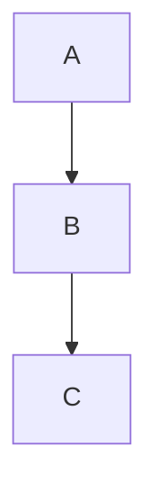

# 見出し1(H1)
## 見出し2(H2)
### 見出し3(H3)
#### 見出し4(H4)
##### 見出し5(H5)
###### 見出し6(H6)

**太字**  
__太字__  
*斜体*  
_斜体_  
~~取り消し線~~  

- 順序なしリスト(-)
  - 順序なしリスト(-)
  - 順序なしリスト(-)
  
+ 順序なしリスト(+)
  + 順序なしリスト(+)
  + 順序なしリスト(+)

* 順序なしリスト(*)
  * 順序なしリスト(*)
  * 順序なしリスト(*)

1. 順序ありリスト
2. 順序ありリスト
   1. 順序ありリスト
   2. 順序ありリスト
3. 順序ありリスト

> 引用
>> 二重引用

---
***
___

`インラインコード`

```python
# Pythonのコードブロック
def hello():
    print("hello")
```

| 見出し1 | 見出し2 |
| --- | --- |
| 内容1 | 内容2 |
| 内容3 | 内容4 |

改行は行末に半角スペース2つ  
もしくは  
<br>を使う


